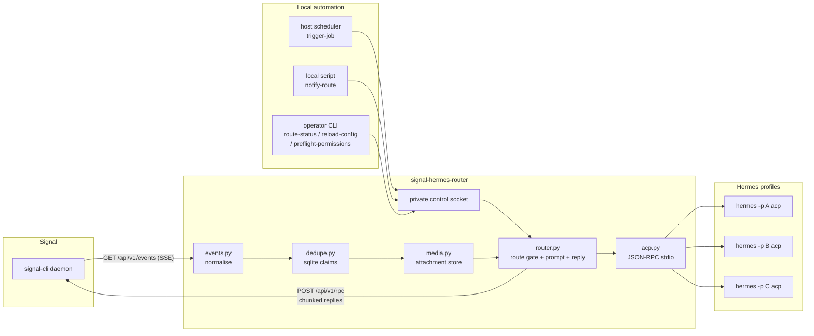

# signal-hermes-router

`signal-hermes-router` is a transport router. It owns one Signal account, consumes allowlisted Signal events from upstream `signal-cli`, maps each route to an independent Hermes profile over ACP, and sends Hermes's replies back to Signal. Routes can target Signal groups, or one explicitly configured direct-message sender. There is no wildcard DM fallback.

It exists to run several independent Hermes profiles behind one Signal number while keeping each profile in its own OS process. Hermes's built-in Signal gateway is profile-scoped by default: each profile runs its own gateway process, and Hermes's Signal adapter takes a `signal-phone` scoped lock on the configured account so two profile gateways cannot share that Signal identity at the same time. Since Hermes `v2026.6.19`, the opt-in multiplexing gateway (`gateway.multiplex_profiles` + `gateway.profile_routes`) can route one shared Signal account's groups to multiple profiles natively - but it runs all of those profiles inside a single gateway process. See [docs/hermes-gateway-tradeoffs.md](docs/hermes-gateway-tradeoffs.md) for the full, current comparison.

The router sits upstream of Hermes and dispatches each group to its own profile as a supervised `hermes -p <profile> acp` subprocess, preserving the one-number, many-agents shape (the same arrangement OpenClaw provided via its own gateway) with per-profile process isolation, and without modifying Hermes gateway internals.

Hermes profiles own behaviour, skills, app access, and media interpretation. The router is the message-bus glue - nothing more.

The four runtime jobs, end to end:



This public tree is intentionally generic. Keep real Signal group IDs, phone numbers, hostnames, profile-private identifiers, route context, state DBs, secrets, and audit checklists in a private deployment repo.

Media normally flows inbound: Signal attachments are normalised, stored on disk, and forwarded to Hermes as ACP content blocks. Configured `notify-route` notifications may also carry one trusted local image path with `--attachment`; the router validates that path under `router.media_root`, freezes it into a private router-owned send artifact, and sends that artifact through a loopback signal-cli daemon with the first reply chunk. Route delivery, chunking, retries, and audit logging stay with the router; profiles do not call Signal directly.

Synthetic route events let trusted local automation trigger a configured route through the already-running router. A host scheduler can send a configured job ID with `trigger-job`; a local script can send a configured notification ID plus bounded JSON payload with `notify-route`, optionally with one validated image attachment. The router then uses the same route state, session policy, permission allowlist, ACP supervision, Signal outbound chunking, retries, redaction, and audit behavior as an inbound Signal turn. Automation never sends Signal directly and never starts its own Hermes ACP session.

## Why a router

The design constraint this repo was built against:

- Hermes profiles are gateway-scoped: the profile docs say "Each profile runs its own gateway as a separate process", and the token-lock section lists Signal among the protected platforms ([Hermes profiles docs](https://hermes-agent.nousresearch.com/docs/user-guide/profiles/)).
- In the default (non-multiplexed) mode, the Signal gateway is configured around one account, plus group allowlisting, not group-to-profile routing ([Hermes Signal docs](https://hermes-agent.nousresearch.com/docs/user-guide/messaging/signal/)).
- The Signal adapter source requires one configured account and acquires a `signal-phone` lock for it; the same adapter subscribes to `signal-cli` events using that account ([signal.py](https://raw.githubusercontent.com/NousResearch/hermes-agent/main/gateway/platforms/signal.py)).
- Hermes scoped locks are explicitly for preventing multiple gateways from using the same external identity at once ([status.py](https://github.com/NousResearch/hermes-agent/blob/main/gateway/status.py#L578-L583)).
- Since Hermes `v2026.6.19`, the "one gateway, multi-profile" shape is a shipped opt-in mode, not just a design discussion: `gateway.multiplex_profiles: true` serves every profile from one gateway process, and `gateway.profile_routes` routes shared-credential chats (Signal groups included) to named profiles ([Hermes multi-profile gateway docs](https://hermes-agent.nousresearch.com/docs/user-guide/multi-profile-gateways), [NousResearch/hermes-agent#23735](https://github.com/NousResearch/hermes-agent/issues/23735)).

That shipped mode covers this router's original routing premise natively. What it does not provide is the router's execution boundary: the multiplexer co-resides all profiles in one OS process (the upstream docs recommend one-process-per-profile for hard crash isolation, which the `signal-phone` lock then forbids on a shared Signal account), and it is Hermes-only and in-process. This router keeps the narrower maintenance boundary: consume Signal once, keep routing policy here, and treat each profile as a black-box ACP subprocess with its own crash domain. If a shared process and Hermes-only profiles are acceptable, prefer the native multiplexing gateway.

## Runtime shape

- Signal transport: `signal-cli -a "$SIGNAL_ACCOUNT" daemon --http 127.0.0.1:8080 --receive-mode=on-connection`
- Signal endpoints used at runtime: `GET /api/v1/events`, `POST /api/v1/rpc`
- Hermes transport: one `hermes -p <profile> acp` subprocess per active profile, supervised by the router
- ACP methods used: `initialize`, `session/new`, optional `session/resume`, `session/prompt`, plus the client-side `session/request_permission` handler. The router also registers reject-all handlers for the `fs/*` and `terminal/*` client methods (matching the zero `clientCapabilities` it advertises), so a misbehaving agent that ignores the capability negotiation gets a clear error rather than silent breakage

Wire references:

- signal-cli JSON-RPC: <https://github.com/AsamK/signal-cli/blob/master/man/signal-cli-jsonrpc.5.adoc>
- Hermes ACP: <https://hermes-agent.nousresearch.com/docs/developer-guide/programmatic-integration> and <https://hermes-agent.nousresearch.com/docs/developer-guide/acp-internals/>
- ACP v1 docs: <https://agentclientprotocol.com/> and <https://agentclientprotocol.com/protocol/schema>
- ACP v1 source: <https://github.com/agentclientprotocol/agent-client-protocol>

## Install

This project uses [uv](https://docs.astral.sh/uv/) as its installer (`hatchling` is the PEP 517 build backend). Install [uv](https://docs.astral.sh/uv/getting-started/installation/) first.

The router is not yet published to PyPI. To install from source:

```bash
git clone https://github.com/deadmanoz/signal-hermes-router.git
cd signal-hermes-router
uv sync                  # lockfile-pinned env in .venv/
. .venv/bin/activate
```

The `signal-hermes-router` CLI script is installed into `.venv/bin/`.

Hermes is installed separately. The router does not import Hermes and does not provide a Hermes optional extra; it supervises the `hermes` CLI from the environment at runtime.

For local development without Hermes:

```bash
uv sync --extra dev
. .venv/bin/activate
PYTHONPATH=src coverage run -m unittest discover -s tests
ruff check .
```

The test suite uses a fake ACP subprocess, so no Hermes install is required.

## Quick start

```bash
cp config.example.yaml /path/to/private/config.yaml
cp routes.example.yaml /path/to/private/routes.yaml
signal-cli -a "$SIGNAL_ACCOUNT" daemon --http 127.0.0.1:8080 --receive-mode=on-connection
signal-hermes-router --config /path/to/private/config.yaml --routes /path/to/private/routes.yaml
```

The long-running command also accepts an explicit `serve` alias:

```bash
signal-hermes-router --config /path/to/private/config.yaml --routes /path/to/private/routes.yaml serve
```

If the private config enables `router.control` and the private routes file defines a scheduled job, a host timer can trigger it through the running router:

```bash
signal-hermes-router --config /path/to/private/config.yaml trigger-job daily-agenda --scheduled-at 1714521600000 --idempotency-key daily-agenda-1714521600000
```

Configured notifications use the same control socket and route-owned delivery path:

```bash
signal-hermes-router --config /path/to/private/config.yaml notify-route backup-report --payload-file /path/to/private/payload.json --idempotency-key backup-report-1714521600000
```

Trusted local automation can attach one staged image to a notification:

```bash
signal-hermes-router --config /path/to/private/config.yaml notify-route camera-person --payload-file /path/to/private/payload.json --attachment /path/to/private/media/camera/person.png --idempotency-key camera-person-1714521600000
```

See [docs/media.md](docs/media.md#outbound-notification-images) for the staging
contract and validation rules.

Operators can inspect route health, circuit state, cached-session state, and
last failure metadata through the same local control socket:

```bash
signal-hermes-router --config /path/to/private/config.yaml route-status --json
```

Operators can reload `routes.yaml` without restarting the router:

```bash
signal-hermes-router --config /path/to/private/config.yaml reload-config
```

Before activating routes or changing allowlists, run a permission preflight
against a private recorded ACP tool-surface contract or the running router:

```bash
signal-hermes-router --config /path/to/private/config.yaml --routes /path/to/private/routes.yaml preflight-permissions --active-only --probe-contract-file /path/to/private/probe-contract.json --json
signal-hermes-router --config /path/to/private/config.yaml preflight-permissions --active-only --control-socket /path/to/private/control.sock --json
```

See [docs/permissions.md](docs/permissions.md#permission-preflight) for the v1
contract, transition checklist, and live-probe behavior.

## Documentation

- [docs/configuration.md](docs/configuration.md) - config schema, secret resolvers, route states, session policies, live reload
- [docs/deployment.md](docs/deployment.md) - generic code sync procedure for private deployments
- [docs/route-context.md](docs/route-context.md) - prompt-safe context keys, nonce delimiter, escaping
- [docs/permissions.md](docs/permissions.md) - what the static ACP permission handler and permission preflight are (and aren't)
- [docs/media.md](docs/media.md) - attachment storage layout, manifests, ACP content blocks
- [docs/no-reply-sentinel.md](docs/no-reply-sentinel.md) - the whole-reply marker a profile emits to deliberately stay silent on a turn
- [docs/scheduled-synthetic-events.md](docs/scheduled-synthetic-events.md) - router-owned scheduler and notification triggers through the local control socket
- [docs/hermes-gateway-tradeoffs.md](docs/hermes-gateway-tradeoffs.md) - what you give up (and gain) versus the built-in Hermes Signal gateway
- [docs/profile-audit-checklist.md](docs/profile-audit-checklist.md) - pre-activation checklist template (use a copy in the private deployment repo)
- [docs/releasing.md](docs/releasing.md) - versioning policy and release procedure

## Project metadata

- Author: deadmanoz
- License: MIT
