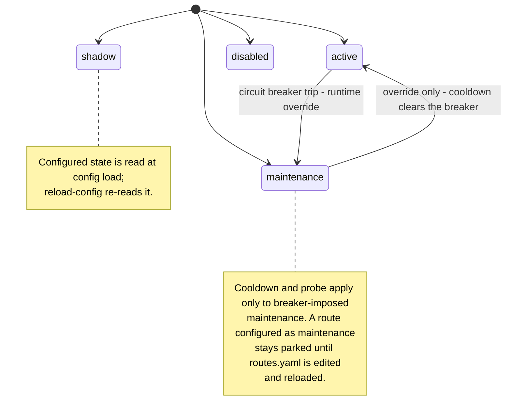
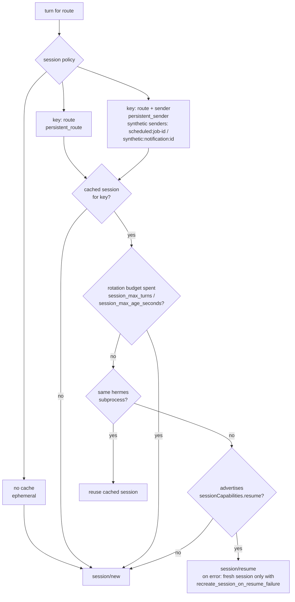

# Configuration

Start from the synthetic examples in the repo root:

```bash
cp config.example.yaml /path/to/private/config.yaml
cp routes.example.yaml /path/to/private/routes.yaml
```

Both files live outside this public tree in deployment.

## Signal endpoint safety

`router.signal.base_url` defaults to `http://127.0.0.1:8080` and must use a
loopback host (`127.0.0.1`, `localhost`, or another loopback IP) unless remote
access is explicitly enabled. This keeps the router from accidentally sending
Signal events or reply authority to an unauthenticated remote `signal-cli`
daemon.

Run `signal-cli` in single-account daemon mode, for example
`signal-cli -a "$SIGNAL_ACCOUNT" daemon --http 127.0.0.1:8080`. The router
does not send an `account` JSON-RPC parameter on each request; account selection
belongs to the upstream daemon invocation. If `signal-cli` is started without
`-a`, it enters multi-account mode and signal-cli requires per-request account
parameters that this router deliberately does not own.

To intentionally use a remote endpoint, set either
`router.allow_remote_signal_base_url: true` or
`router.signal.allow_remote_base_url: true` in the private deployment config.
For legacy flat configs that omit the `router:` wrapper, use
`allow_remote_signal_base_url: true` beside `signal_base_url`.

## Filesystem layout

The router writes private state under a handful of paths. All defaults are
relative to the working directory of the running process; in production
deployments these are typically absolute paths under the service's private
data root. The router-managed roots (`media_root` and `work_root`) are
created with `0700` permissions, and files written beneath them are written
with `0600` (see `signal_hermes_router.private_fs`). The dedupe sqlite DB at
`router.state_db` sits outside these roots by default and gets its own
`0700`/`0600` enforcement from the dedupe layer (see the `router.state_db`
bullet below). `signal_attachment_root` is read-only
from the router's perspective and is not created or chmodded by the router.

- `router.state_db` (default `./private/state/router.db`) - sqlite database
  used by the dedupe layer (`signal_hermes_router.dedupe`) to record
  route-scoped event claims. The file itself is `0600`; its parent directory
  is created `0700`. This must be a filesystem path: `:memory:` is not
  supported for a running router, because dedupe would not survive restarts
  and the store's exclusive-ownership lock cannot span processes (in-memory
  stores exist only as injected test doubles). The store runs in WAL journal
  mode (compatible with, and subordinate to, its exclusive single-owner
  lock), so a transient `<state_db>-wal` sidecar - also `0600` - exists
  while the router runs. It is removed on clean shutdown; after a crash it
  persists and is recovered automatically at the next startup. No `-shm`
  file is created.
- `router.media_root` (default `./private/media`) - root for attachments and
  their sidecar manifests written by `signal_hermes_router.media`. See
  [media handling](media.md) for the on-disk layout.
- `router.work_root` (default `./private/work`) - root for per-profile working
  state used by the ACP subprocess supervisor
  (`signal_hermes_router.sessions`).
- `router.control.socket_path` (default `router.work_root / "control.sock"`
  when control is enabled and no explicit path is set) - local Unix socket
  used by `signal-hermes-router trigger-job`, `notify-route`, `route-status`,
  `reload-config`, and `preflight-permissions` to interact with the running
  router.
- `router.signal_attachment_root` (default
  `~/.local/share/signal-cli/attachments`) - read-only path used to resolve
  signal-cli events that reference an attachment by ID instead of carrying
  inline bytes. The value is `expanduser`-ed at config load time. The router
  does not create or change permissions on this directory.

## Live configuration reload (routes only)

The router can reload its `routes.yaml` without restarting the process. This is
useful when adding new notification definitions, scheduled jobs, or changing route
states. Router-level settings (`config.yaml`) — including signal endpoint,
media_root, work_root, state_db, circuit breaker thresholds, control socket
path, and retention intervals — are bound at startup and require a process
restart to change.

### Control socket command

```bash
signal-hermes-router reload-config
```

By default the router re-reads the same `routes.yaml` it was started with.
Override with a candidate file:

```bash
signal-hermes-router reload-config --candidate-routes /path/to/new/routes.yaml
```

The CLI resolves the override to an absolute path before sending it, and the
router rejects a relative `candidate_routes` override outright — a relative
path would resolve against the long-running daemon's working directory, not
the shell the operator ran the command from:

```json
{"error": "candidate_routes_not_absolute", "generation": 0, "status": "error"}
```

### Response

A successful reload returns a JSON response with a monotonic generation counter:

```json
{"generation": 1, "route_count": 3, "status": "ok"}
```

An invalid candidate leaves the active configuration unchanged and returns:

```json
{"detail": "ValueError", "error": "config_invalid", "generation": 0, "status": "error"}
```

If the candidate `routes.yaml` is paired with a different `config.yaml` (i.e.
router-level settings changed), the reload is rejected:

```json
{"error": "router_config_changed", "generation": 0, "status": "error"}
```

If an existing route key changes its Hermes `profile`, the reload is also rejected
because session and circuit-breaker state are keyed by route key and would become
inconsistent:

```json
{"error": "profile_changed_for_existing_route", "generation": 0, "status": "error"}
```

The candidate parse is bounded server-side (60 s): a blocking filesystem read or
a hung secret resolver fails the reload instead of holding every later reload
request behind it:

```json
{"error": "config_parse_timeout", "generation": 0, "status": "error"}
```

A timed-out parse's worker thread cannot be killed, so its dedicated executor
is detached and the next reload parses on a fresh one — an operator fix to the
routes file or secret reference takes effect without restarting the router.
Detachments are capped (3); beyond that the wedged executor is kept and later
reloads fail fast instead of queueing another parse behind the hung worker:

```json
{"error": "config_parse_saturated", "generation": 0, "status": "error"}
```

The saturation clears on its own once every abandoned hung worker has exited
and the kept executor's hung item has completed (a fixed routes file or
secret reference unblocks it); until then, or if the wedge is permanent, the
recovery is a router restart.

Reloads never re-resolve router-level secrets: the candidate routes are parsed
against the router's already-validated startup `RouterConfig`, and router-level
drift is detected by fingerprinting the raw, unresolved `config.yaml` (any
structural or scalar edit — short of formatting and comments — rejects the
reload as `router_config_changed`). A valid routes-only change therefore
succeeds even when a startup-only `env://`/`op://` value is no longer
resolvable. Candidate parses run on a dedicated single-thread executor, so a
hung resolver cannot consume the turn I/O workers that dedupe and media writes
depend on. The control-socket CLI commands themselves (`reload-config`,
`route-status`, `trigger-job`, `notify-route`) likewise do not resolve unrelated
router secrets: they discover the control socket from the raw config, so they
keep working while the daemon is up even when a startup-only secret has
expired. Only `notify-route` additionally reads
`router.control.max_notification_payload_bytes` for client-side payload
prevalidation; the other commands never touch that notify-only value.

### Safety guarantees

- **Parse-before-swap, off the event loop**: The candidate file is fully
  parsed and validated in a worker thread before any runtime state changes,
  so a slow secret resolver (e.g. `op://`) or filesystem cannot stall Signal
  event handling, control responses, or ACP timeouts. Only the validated
  swap happens on the event loop.
- **Routes-only**: Only routes, scheduled jobs, and notification definitions
  may change on reload. Router-level settings remain bound to startup values.
- **Profile stability for existing routes**: A route key that already exists
  cannot change its `profile` on reload.  This prevents session cache and
  circuit-breaker state from becoming inconsistent.  Remapping a group to a
  different profile requires a process restart.
- **In-flight preservation**: Turns already admitted use their original
  `Route` objects; only new turns see the updated configuration. Note that
  in-flight turns may still read a handful of router-level settings (e.g.
  `media_root`, `max_attachment_bytes`) live from `self.config.router` across
  await boundaries, so a reload during an active turn can observe a mix of old
  and new values for those fields. In practice this is safe because the
  router-level settings are rejected from changing (see Routes-only above).
- **Retired-route cleanup**: Routes that can no longer prompt after a reload
  (reloaded to `shadow`/`disabled`/`maintenance`, or removed) have their
  cached sessions evicted, and a Hermes profile left with no remaining active
  route has its cached subprocess closed. Still-active routes whose
  `session_policy` changed have their now-unreachable cached sessions evicted
  too — including sessions left over from a remove/re-add cycle or from a
  previous reap that timed out, which the registry-level mismatch scan
  rediscovers on every reload. All of this happens only after in-flight turns
  on the affected routes drain — the reap is scheduled whenever any known
  route key leaves the active set, so a turn admitted just before the swap
  (still creating its session in its pre-lock awaits) is caught as well — and
  the pre-drain wait is scoped to turns that can touch an affected route, so
  a long turn on an unrelated active route cannot consume the drain bound.
  The drain bound tracks the supervisor's prompt timeout plus a margin, so a
  healthy long-running prompt is always waited out. If a turn is still
  running when the bound expires, its route is left un-drained (its session
  and profile stay cached) and a follow-up reap retries until it finishes.
  The retries are bounded (3 follow-ups): a genuinely wedged turn then has
  the cleanup completed under it — cached session evicted, profile retired —
  so it fails through the normal broken-pipe path without pinning retired
  runtime state forever. Profiles and sessions for routes that stayed
  active (with unchanged policy) are untouched.
- **Breaker-override coherence**: A stale circuit-breaker `MAINTENANCE`
  override is cleared when the route's configured state becomes anything
  other than `active`, so a reloaded `shadow`/`disabled` route applies
  immediately instead of sending maintenance replies. An override on a route
  that stayed `active` survives — reload never silently resets a tripped
  breaker; normal recovery clears it. A turn already admitted under an open
  breaker keeps the maintenance mask even when a concurrent reload clears
  the override before the turn runs: queued pre-reload work never probes the
  profile that was failing at admission.
- **Serialized application**: Concurrent `reload-config` calls apply in
  command order — a slower candidate parse can never swap its older
  candidate over a newer configuration.
- **Redacted rejection logging**: A rejected candidate's route identifiers
  were never registered with the redactor, so rejection logging reports only
  the exception class and never emits a traceback at any log level.
- **Orphaned rate-limit cleanup**: Rate-limit buckets for removed routes are
  pruned; active-route buckets survive the reload. In-flight turns refund
  their reserved token to the exact bucket they reserved from, so a refund
  can never mint capacity in a replacement bucket created by a later
  remove/re-add cycle.
- **Redaction continuity**: Route identifiers from both old and new
  configurations remain in the redactor so no identifiers leak across reload.

### Deployment sequence

1. Validate the candidate `routes.yaml` locally (e.g. with a test instance or
   by running `signal-hermes-router` in a temporary environment). For a quick
   secret-safe check, `scripts/check-private-config.py CONFIG ROUTES` parses
   both files and prints only the route count, a per-state summary, and the
   `allow_remote_signal_base_url` flag - no secrets, Signal identifiers, or
   route keys.
2. Atomically replace the routes file on disk (e.g. `mv routes.yaml.new routes.yaml`).
3. Run `signal-hermes-router reload-config`.
4. Inspect the response `generation` to confirm the reload took effect.

## Secret resolvers

String values in YAML are passed through `signal_hermes_router.secrets.resolve_secret_refs`. Supported URI schemes:

- `file:///absolute/path` - read the file contents
- `env://VARIABLE_NAME` - read the named environment variable
- `op://...` - run `op read`; the 1Password CLI must be installed and authenticated
- `systemd-credential://credential-name` - read a single credential basename from `$CREDENTIALS_DIRECTORY`

`systemd-credential://` names must be basenames. Path separators and dot
segments are rejected so a credential URI cannot escape the systemd credential
directory.

## Route states

Defined in `signal_hermes_router.models.RouteState`:

- `shadow` - store media and log redacted route decisions only; do not call Hermes, do not reply
- `active` - call Hermes and reply to Signal
- `maintenance` - store minimal event information and send one bounded maintenance reply
- `disabled` - redacted audit only; nothing else

A route's state is read at config load time. A circuit-breaker trip can override a route to `maintenance` at runtime (`signal_hermes_router.circuit`).

Configured states come from `routes.yaml`; the circuit breaker can override at runtime:



## Session policies

Defined in `signal_hermes_router.models.SessionPolicy`:

- `persistent_route` - one ACP session per route, shared across senders and turns
- `persistent_sender` - one ACP session per `(route, sender)` pair
- `ephemeral` - a fresh ACP session per turn

Sessions are replaced when the underlying Hermes subprocess restarts. If the
Hermes profile advertises `sessionCapabilities.resume`, the router will call
`session/resume` rather than creating a new session. By default, a raised
`session/resume` error still surfaces as an ACP session failure. A persistent
route can opt into discarding that stale cached session and creating a fresh
one by setting `recreate_session_on_resume_failure: true`.

A persistent session otherwise lives forever, so conversation context
accumulates turn after turn until the model backend fails on a busy route. A
persistent route can bound this with session rotation via `session_max_turns`
and/or `session_max_age_seconds`: when a cached session has served that many
turns, or is older than that many seconds, the router drops it and the next
turn starts a fresh session (`session/new`) on the same running Hermes
subprocess. No restart, no resume; the rotation is logged as a content-free
line carrying the hashed route reference. For `persistent_sender` routes the
limits apply per cached `(route, sender)` session. A session that survives a
subprocess restart through `session/resume` keeps its accumulated context, so
its rotation budget carries over; a recreated session starts a new budget.

How `SessionRegistry.get` picks between reusing, resuming, and creating a session:



## Route schema

Each entry in `routes.yaml` is parsed by `signal_hermes_router.config.parse_route`.
Required keys are listed first; optional keys carry their defaults.

- `platform` (required) - transport identifier; currently only `"signal"` is
  used in production.
- `profile` (required) - Hermes profile name. Must match
  `[A-Za-z0-9][A-Za-z0-9._-]{0,63}` and must not contain path separators; the
  router supervises one `hermes -p <profile> acp` subprocess per profile.
- `chat_type` (optional, default `group`) - route target type. `group` routes
  target Signal groups. `direct` routes target one exact Signal sender identity.
- `group_id` (required for `group`, forbidden for `direct`) - opaque
  per-platform group identifier. For Signal, this is the base64 group-v2 ID
  emitted by `signal-cli`.
- `sender_id` (required for `direct`, ignored for `group`) - exact direct
  sender identity. Use the Signal `sourceUuid` value and load it from private
  config through a secret resolver such as `env://SIGNAL_DIRECT_SENDER_UUID`.
- `sender_number` (optional for `direct`, ignored for `group`) - secondary
  exact sender number used only when an inbound direct event lacks
  `sourceUuid`. If `sourceUuid` is present and does not match `sender_id`, the
  router discards the event even when `sender_number` matches.
- `session_policy` (optional, default `persistent_route`) - one of the
  [session policy](#session-policies) values.
- `recreate_session_on_resume_failure` (optional, default `false`) - for
  persistent routes, discard a stale cached session and create a fresh session
  if `session/resume` raises after a Hermes subprocess restart. This does not
  change `ephemeral` routes, and it does not affect the existing fallback where
  Hermes returns "resume unsupported" and the router creates a fresh session.
- `session_max_turns` (optional, default off) - integer >= 1. Rotate the
  cached persistent session after it has served this many turns; the next
  turn gets a fresh session without a subprocess restart. Rejected on
  `ephemeral` routes. See [session policies](#session-policies).
- `session_max_age_seconds` (optional, default off) - positive number of
  seconds. Rotate the cached persistent session once it is at least this old.
  Rejected on `ephemeral` routes. See [session policies](#session-policies).
- `state` (optional, default `shadow`) - one of the [route state](#route-states)
  values.
- `name` (optional) - stable private selector used by `scheduled_jobs` and
  `notifications`.
  Must match `[A-Za-z0-9][A-Za-z0-9._-]{0,63}` and be unique when present.
  Do not use `friendly_name` for synthetic route selection.
- `route_context` (optional, default `{}`) - JSON-serialisable mapping of
  private route metadata. Only the code-controlled prompt-safe keys are sent
  to Hermes; the rest stay in `routes.yaml`. See [route context](route-context.md).
- `permissions` (optional, default `[]`) - static ACP permission allowlist
  for this route. Denylists are rejected at parse time. See [permissions](permissions.md)
  for the predicate shape.
- `mcp_only` (optional, default `false`) - when `true`, the preflight
  permission scan reports `local_tool_exposed` for any local terminal/fs tool
  found either in the profile's `full_callable` surface or in the route's (and
  its scheduled jobs' and notifications') permission allowlist. The router also
  defense-in-depth rejects `session/request_permission` for those tools at
  runtime. See [permissions](permissions.md#mcp-only-routes).
- `friendly_name` (optional) - private operator-facing label. Never sent over
  ACP; only used in redacted logs.
- `maintenance_reply` (optional) - per-route override for
  `router.maintenance_reply` (see [Operational reply strings](#operational-reply-strings)).
- `failure_reply` (optional) - per-route override for `router.failure_reply`.
- `max_event_age_seconds` (optional, default off) - positive number of
  seconds. See [Inbound burst policy](#inbound-burst-policy).
- `inbound_rate_limit` (optional, default off) - mapping with exactly two
  keys, `max_turns` (integer >= 1) and `window_seconds` (positive number).
  See [Inbound burst policy](#inbound-burst-policy).

For group routes, `(platform, group_id)` must be unique across the routes list.
For direct routes, `(platform, sender_id)` must be unique, and any configured
`sender_number` must not be reused by another direct route. Direct routes do not
provide a default DM route or wildcard sender; wildcard-like identities such as
`*` are rejected at config load.

## Scheduled synthetic route jobs

`scheduled_jobs` is a top-level list in `routes.yaml`. A job is trusted
deployment config for a local scheduler; it is not a Signal event and it does
not contain raw Signal group IDs. Each job targets a route by the route's
stable `name`.

```yaml
routes:
  - platform: "signal"
    name: "agenda-route"
    group_id: "SIGNAL_GROUP_ID_BASE64_EXAMPLE"
    profile: "example-hermes-profile"
    state: "active"

scheduled_jobs:
  - id: "daily-agenda"
    route: "agenda-route"
    prompt: "Prepare the synthetic daily agenda for this route."
    description: "Optional operator note, not sent to Hermes."
```

Job keys:

- `id` (required) - safe token used by `trigger-job` and host timers. Must
  match `[A-Za-z0-9][A-Za-z0-9._-]{0,63}` and be unique.
- `route` (required) - a configured route `name`.
- `prompt` (required) - trusted scheduled prompt text from private deployment
  config. Empty prompts are rejected.
- `description` (optional) - operator note. It is not sent to Hermes.
- `permissions` (optional) - static ACP permission allowlist for this one
  scheduled turn. When omitted, the route's normal `permissions` apply.

Scheduled turns use the selected route's state gate and session policy. A
`persistent_route` scheduled turn shares the route session with later Signal
messages; a `persistent_sender` scheduled turn is keyed to a synthetic sender
for that job; an `ephemeral` scheduled turn gets a fresh session.

## External route notifications

`notifications` is a top-level list in `routes.yaml`. A notification is trusted
deployment config for a local script that already has a structured result to
report. Scripts pass only a configured notification ID and a bounded JSON
payload to the router; they do not send Signal, choose raw Signal targets, or
start Hermes sessions themselves.

```yaml
notifications:
  - id: "backup-report"
    route: "agenda-route"
    prompt: "Summarize the notification payload for this route."
    description: "Optional operator note, not sent to Hermes."
```

Notification keys:

- `id` (required) - safe token used by `notify-route`. Must match
  `[A-Za-z0-9][A-Za-z0-9._-]{0,63}` and be unique within `notifications`.
- `route` (required) - a configured route `name`.
- `prompt` (required) - trusted notification prompt text from private
  deployment config. Empty prompts are rejected.
- `description` (optional) - operator note. It is not sent to Hermes.
- `permissions` (optional) - static ACP permission allowlist for this one
  notification turn. When omitted, the route's normal `permissions` apply.

Notification payloads must be JSON objects or arrays. The CLI and router both
canonicalize the payload to compact JSON with sorted object keys before
applying `router.control.max_notification_payload_bytes`.

## Router control socket

`router.control` is disabled by default. When enabled, the running router
serves a local Unix socket and accepts JSON-lines control commands. The CLI
uses that socket; it does not send Signal, start Hermes, or call ACP on its
own.

```yaml
router:
  work_root: "./private/work"
  control:
    enabled: true
    # Optional. Defaults to ./private/work/control.sock for this work_root.
    socket_path: "./private/work/control.sock"
    # 0 means acquire-or-return-busy immediately.
    route_lock_timeout_seconds: 0
    # Compact JSON bytes after canonicalization. Default: 16384.
    max_notification_payload_bytes: 16384
```

The socket path must be under `router.work_root`. The socket parent is created
with `0700` permissions and the socket is chmodded to `0600` where the platform
supports it. Startup refuses a path outside `router.work_root`, a non-socket
file at the configured path, or a live socket already accepting connections
there. A stale socket is removed only after the router proves no listener is
accepting connections there.

All control subcommands (`trigger-job`, `notify-route`, `route-status`,
`reload-config`, and `preflight-permissions`) accept `--control-socket` to
override the socket path discovered from the config.

Use `trigger-job` from a host scheduler:

```bash
signal-hermes-router --config /path/to/private/config.yaml trigger-job daily-agenda --scheduled-at 1714521600000 --idempotency-key daily-agenda-1714521600000
```

Use `notify-route` from a local script:

```bash
signal-hermes-router --config /path/to/private/config.yaml notify-route backup-report --payload-file /path/to/private/payload.json --idempotency-key backup-report-1714521600000
```

To include one trusted image with a configured notification, stage it under
`router.media_root` and pass its absolute path:

```bash
signal-hermes-router --config /path/to/private/config.yaml notify-route camera-person --payload-file /path/to/private/payload.json --attachment /path/to/private/media/camera/person.png --idempotency-key camera-person-1714521600000
```

Use `preflight-permissions` before route activation or allowlist changes:

```bash
signal-hermes-router --config /path/to/private/config.yaml --routes /path/to/private/routes.yaml preflight-permissions --active-only --probe-contract-file /path/to/private/probe-contract.json --json
```

To inspect profiles through the running router's normal ACP supervisor, target
the control socket instead of supplying a recorded contract:

```bash
signal-hermes-router --config /path/to/private/config.yaml preflight-permissions --active-only --control-socket /path/to/private/control.sock --json
```

Use `route-status` to inspect route health, circuit state, cached-session
state, and the most recent success/failure metadata from the running router.
It accepts the same selector families as `preflight-permissions`: `--route`,
`--route-index`, and `--profile`, each repeatable:

```bash
signal-hermes-router --config /path/to/private/config.yaml route-status --json
signal-hermes-router --config /path/to/private/config.yaml route-status --route agenda-route --profile example-hermes-profile
signal-hermes-router --config /path/to/private/config.yaml route-status --route-index 2 --json
```

`--scheduled-at` accepts either an epoch millisecond integer or a timezone-aware
ISO 8601 timestamp. Naive datetimes are rejected. `--idempotency-key` is hashed
before it is used in the dedupe identity. Reusing the same `--scheduled-at` or
the same idempotency key dedupes repeated timer attempts for the same job fire:
identities the router persisted as `handled` stay deduplicated, including
across restarts, and a `processing` claim held by a live router keeps
reserving the identity while its turn runs (concurrent attempts for the same
route can also wait on the route lock or return `busy`). Only claims left
`processing` by a crash mid-turn are reclaimed at the next startup, so a retry
with the same key then delivers instead of reporting `deduped`; a crash after
the Signal send but before the identity is marked `handled` can therefore
duplicate output on retry. Synthetic failures during Hermes work still
release their claim for deliberate retry, while Signal send failures after
completed Hermes work mark the identity `handled` (see
[docs/scheduled-synthetic-events.md](scheduled-synthetic-events.md)).
`--client-timeout` bounds the local control socket round trip and defaults to
300 seconds. `notify-route` reads `--payload-file` as UTF-8 JSON, rejects
non-object and non-array payloads, and applies the configured compact JSON byte
limit before writing to the socket. The router repeats that validation and
returns a JSON `payload_too_large` error for marginally over-limit requests
that fit inside the control request headroom.

`notify-route --attachment` accepts one image path. See [docs/media.md](media.md#outbound-notification-images) for the full staging contract, validation rules, `.outbound` artifact behavior, and remote-signal-cli restrictions.

`preflight-permissions` compares configured permission tool names against a
version 1 ACP tool-surface contract. See [Permissions](permissions.md#permission-preflight)
for the contract shape, live-probe behavior, and production transition checklist.

Reports use only `route:<name>` or `routes[<index>]` references, profile names,
source IDs, and tool names. They do not report raw Signal IDs, direct sender
IDs, route keys, secrets, or permission argument predicates.

`route-status` reports the same safe route references plus route state, session
policy, cached-session count, circuit state, last success timestamp, and last
failure metadata. It does not report raw Signal group IDs, direct sender IDs,
phone numbers, route keys, local filesystem paths, prompt text, or payload
JSON. Last failures use stable provider-neutral codes such as
`acp_session_failed`, `acp_prompt_timeout`, `signal_send_failed`,
`model_auth_failed`, `model_rate_limited`, `model_unavailable`,
`model_timeout`, and `endpoint_unreachable`. Provider-specific raw diagnostics
are kept only as bounded sanitized `detail` / `provider_detail` fields. Model
and endpoint classifications are most reliable when Hermes supplies structured
JSON-RPC `error.data.code`; otherwise the router applies only conservative
generic text fallbacks and may report `unknown`. ACP session acquisition is
stricter: model/provider session failures are reclassified only from structured
`error.data.code`, so text-only `429` or quota wording remains
`acp_session_failed`. `provider_class` is populated only from structured
`error.data.provider_class` values of `cloud_api`, `local_endpoint`, or
`unknown`.

CLI exit status is zero for `delivered`, `deduped`, `busy`, and expected
`skipped` outcomes such as shadow or disabled routes. It is non-zero for an
unavailable socket, malformed request or response, unknown synthetic ID, config
parse error, or router-reported `error`.
For `preflight-permissions`, exit status is zero only when the report status is
`ok`. For `route-status`, exit status is zero when the control response status
is `ok`.

The global `--log-level` flag (default `INFO`) applies to every subcommand,
including `serve`, and is placed before the subcommand name, e.g.
`signal-hermes-router --config /path/to/private/config.yaml --log-level DEBUG serve`.

## Runtime size limits

`router.max_attachment_bytes` bounds inline Signal attachment decoding and
path-backed attachment reads. The default is `26214400` bytes (25 MiB).
Oversize attachments raise before storage or ACP delivery. For path-backed
attachments the dedupe claim is released so the event can be retried after
config or source data is corrected; for inline base64 attachments the
size check fires inside event parsing before any dedupe claim is taken,
so the event is retried only if the upstream Signal stream replays it.

`router.max_signal_event_bytes` bounds each Signal SSE event before JSON parsing.
When omitted, it defaults to twice `max_attachment_bytes`; with the default
attachment cap this is `52428800` bytes (50 MiB). This leaves room for base64
encoding overhead around a maximum-size inline attachment while still preventing
unbounded event accumulation.

`router.max_acp_line_bytes` bounds each ACP JSON-RPC stdout line from the Hermes
subprocess. The default is `8388608` bytes (8 MiB). This is a defensive
allocation cap, not an ACP protocol limit; if a single Hermes stdout line
exceeds the cap, the offending line is logged and skipped and the peer is
kept alive. The same byte cap is applied to the Hermes stderr stream so an
oversized stderr line cannot back-pressure the subprocess into deadlock.

`router.max_reply_chars` bounds each outbound Signal reply after any route
`canary_reply_prefix` value is applied. The default is `12000` characters.
Oversize replies
are truncated and marked before they are sent; this is an operational
spam/resource guardrail, not a Signal protocol limit.

`router.max_signal_message_bytes` bounds each individual Signal message
dispatched by the router, measured in UTF-8 bytes (not characters - non-ASCII
text like emoji or CJK can produce more bytes than characters). Replies
longer than this are split into multiple sequential messages prefixed with
`[N/M] ` ordering markers; single-chunk replies are sent without a marker.
The default is `1900` bytes, chosen to sit safely below Signal-Desktop's
2048-byte long-attachment threshold (the marker itself consumes part of each
chunk's budget). Values below `16` are rejected at config load; values above
`2000` are accepted with a warning - Signal-Android may silently truncate the
body and Signal-Desktop may convert it to an attachment. At pathologically
tight settings (a budget close to the 16-byte floor combined with very long
multibyte input), the marker may not fit alongside even one codepoint of
body; the router then falls back to safe unmarked chunks at the byte cap.
Production defaults have ample marker headroom.

## Hermes turn timeout and busy notice

`router.acp_prompt_timeout_seconds` bounds each `session/prompt` JSON-RPC
request to the Hermes subprocess. The default is `300` seconds (5 minutes).
When the timeout is exceeded the router restarts the Hermes profile and
records a circuit-breaker failure for the route. The other session-management
requests (`session/new`, `session/resume`) use a fixed 5-minute timeout and
are not affected by this key.

`router.acp_initialize_timeout_seconds` bounds the `initialize` handshake
request issued when a Hermes profile subprocess is started. The default is
`30` seconds; the value must be a positive finite number. Profile startup
runs while the route and profile locks are held, so a hung Hermes startup
would otherwise block the route for the full 5-minute request default. When
the timeout is exceeded the turn fails with `acp_session_failed` (the failure
detail names the ACP initialize timeout), a circuit-breaker failure is
recorded, and the supervisor's restart cooldown - a fixed 5-second code
constant (`DEFAULT_RESTART_COOLDOWN_SECONDS` in
[src/signal_hermes_router/sessions.py](../src/signal_hermes_router/sessions.py)),
not configurable - makes immediately-following turns refuse fast instead of
re-spawning a doomed subprocess. The setting
bounds the request wait itself; the failure propagates after subprocess
cleanup, which can add up to a few more seconds of SIGTERM grace before the
process is killed.

Failure metadata distinguishes router-owned ACP prompt timeouts from
provider-facing model timeouts. A bare router-side wait timeout is reported as
`acp_prompt_timeout`. `model_timeout` requires structured Hermes error data or
a generic provider-facing timeout signal in the error text.

`router.busy_notice_after_seconds` (default `120`) controls how long a turn
may run before a one-shot busy notice is sent to the Signal target. To keep
the notice meaningful, configure
`busy_notice_after_seconds < acp_prompt_timeout_seconds`.

`router.busy_notice_cooldown_seconds` (default `0`, disabled) rate-limits the
busy notice itself: after a notice is sent for a route, further slow turns on
that route stay quiet until the cooldown has elapsed. The default preserves
the historical one-notice-per-slow-turn behaviour; in a busy group where
several queued turns each run long, a cooldown keeps the router from
repeating "Still working on this." every turn. The cooldown window starts
only when a notice is actually delivered - a failed notice send is retried
by the next slow turn as before.

## Inbound burst policy

Two per-route knobs in `routes.yaml` protect busy many-participant groups at
the transport layer. Both are off by default; neither changes profile-side
behaviour. They apply only to inbound Signal turns - synthetic turns
(`trigger-job`, `notify-route`) keep their existing
`route_lock_timeout_seconds`/busy admission control.

```yaml
routes:
  - platform: "signal"
    group_id: "SIGNAL_GROUP_ID_BASE64_EXAMPLE"
    profile: "example-hermes-profile"
    state: "active"
    max_event_age_seconds: 900
    inbound_rate_limit:
      max_turns: 10
      window_seconds: 60
```

- `max_event_age_seconds` - freshness gate. A routed Signal event whose
  timestamp is older than this many seconds at the moment its turn would run
  is dedupe-claimed, marked handled, and skipped without prompting, so a
  backlog drain (for example signal-cli replaying queued messages after
  downtime) does not answer hours-old messages. Staleness is evaluated
  twice: once under the route lock alone, so an already-stale backlog event
  is discarded immediately instead of queueing behind another route's long
  turn on a shared profile, and again once the turn holds the profile lock,
  so an event that ages out while queued (including behind another route's
  turn on a shared profile) is also skipped. Because the skip marks the
  event handled in the dedupe store, redelivery of a skipped event stays
  skipped. Events without a usable timestamp (the normalizer emits `0`)
  bypass the age check rather than being treated as infinitely old.
- `inbound_rate_limit` - token-bucket cap on prompted inbound turns.
  Sustained admission is `max_turns / window_seconds` turns per second with
  bursts up to `max_turns`. Turns beyond the rate are dropped:
  dedupe-claimed, marked handled, and logged as a content-free INFO line
  carrying only the redacted route reference. A token is reserved after the
  route-state gate but before attachment storage and ACP session
  acquisition, so an over-limit burst sheds before consuming media I/O or
  `session/new` work, and the token is refunded if an admitted turn fails
  before the prompt (attachment storage or session acquisition failures).
  The cap therefore counts only turns that actually reach the Hermes
  prompt: turns gated by route state (`maintenance`, `disabled`, `shadow`)
  and deduplicated redeliveries never consume tokens, and a route that
  accumulates traffic while inactive does not drop its first turns after
  (re)activation. `max_turns` must be an integer >= 1 (booleans and
  fractional values are rejected); `window_seconds` must be a positive
  finite number.

Dropped and skipped events are permanent for that event identity: the router
deliberately declines the turn and records it as handled. Operators who need
delivery of every message under sustained overload should leave the rate cap
off and scale the profile instead.

## Concurrent inbound dispatch

`router.max_concurrent_turns` (default `8`, integer >= 1) bounds how many inbound
Signal turns may execute at once. Inbound events are dispatched as independent
tasks rather than processed strictly one at a time, so a single slow turn (up to
`acp_prompt_timeout_seconds`) on one route no longer stalls delivery to every other
route. Same-route events are still serialized and delivered in arrival order by the
route lock, and same-profile turns are still serialized by the profile lock, so a
route consumes at most one of these slots at a time. Raise the value for
deployments with many distinct active profiles that should progress in parallel;
lower it to cap concurrent load on the host or on shared model capacity.

The bound applies to turn execution: the permit is held only while a turn actually
runs, so a same-route event queued behind a slow turn holds no slot and cannot
starve other routes. Separately, an internal in-flight buffer bounds the number of
dispatched-but-not-yet-finished turn tasks so a burst cannot grow an unbounded task
set; when that buffer fills (a sustained flood from one route while its turn is
slow), the router applies backpressure to the Signal read until capacity frees.
A second, independent ceiling bounds the same buffer by total in-flight
raw-payload bytes (256 MiB, raised to one maximum-size event when a single
event exceeds it, so a lone oversized event is never wedged) and triggers the
same Signal-read backpressure alongside the count bound; without it a burst of
large inline-attachment events could retain many gigabytes in queued task
frames. Both bounds are code constants, not configuration.
This buffer is global rather than per-route, so a single route flooding faster than
it can be processed can delay other routes once the buffer is full; that is strictly
better than the pre-dispatch behaviour (where any slow turn stalled every route) but
is not full per-route flood fairness. The bound applies only to inbound Signal
turns; synthetic turns (`trigger-job`, `notify-route`) keep their own
`route_lock_timeout_seconds` admission control.

The execution permit is the last resource an inbound turn takes: it is acquired
inside the profile lock and released only when the turn finishes, so a turn
queued behind its route or profile lock spends no global capacity and a slow
shared-profile backlog cannot starve turns on idle profiles. While a turn waits
for global capacity it holds no profile lock, so a synthetic turn on another
route sharing that profile is admitted normally (no spurious `BUSY`) and runs
ahead of the capacity-queued inbound turn. If such a synthetic is running when
capacity frees, the inbound releases the permit it just won and queues behind
the synthetic holding no slot, so global capacity is never parked behind an
operator-driven turn.

Known limitation: concurrent dispatch widens the crash-loss window compared with
the old strictly serial consumer. Several accepted events can be in memory at
once — dispatched but still queued behind route, profile, or execution capacity
before their turn creates a dedupe claim — and signal-cli's event stream has no
replay or acknowledgement, so a hard crash (or a shutdown drain timeout) loses
those consumed-but-unclaimed events; previously at most one in-flight event was
exposed. Accepted events are bounded by the in-flight buffer above, and a
graceful shutdown drains them to completion, so the residual exposure is forced
termination. Durable inbound admission (persisting accepted events before their
turn runs) is deliberately out of scope for this change and may be addressed as
a follow-up.

## Retention sweeps

`router.retention` bounds the two router-owned stores that otherwise grow
forever: the dedupe state DB and the archived-media tree. One sweep runs at
router startup and then once per `sweep_interval_seconds` (default `21600`,
6 hours). Sweep logging is counts-only (rows, files, bytes, directories);
no filename, identifier, or path ever appears in a sweep log line.

- `router.retention.dedupe_handled_seconds` (default `2592000`, 30 days) -
  delete `handled` dedupe rows whose retention clock is older than this.
  The clock is a router-owned wall-clock timestamp recorded when the row
  was last written, not the sender-controlled Signal event timestamp, so
  idempotency-key identities (whose event timestamp is a sentinel `0`) age
  by when they were handled and forged event timestamps cannot evade or
  outlive retention. `processing` claims are never pruned. `null` disables
  dedupe pruning. Values below `86400` (1 day) are rejected at config load
  so retention always comfortably exceeds the Signal redelivery and
  synthetic retry window; consequently, an identity whose row has aged out
  is re-handled if the upstream replays it after the window.
- `router.retention.media_max_age_seconds` (default off) - delete archived
  attachment/manifest pairs older than this. Deleting stored media is data
  loss, so the age pass is opt-in; values below `86400` are rejected.
- `router.retention.media_max_total_bytes` (default off) - size cap for
  the archived-media subtree; when the archive exceeds it, the oldest
  attachment groups are deleted first until at or under the cap.
- `router.retention.sweep_interval_seconds` (default `21600`) - time
  between periodic sweeps; must be a positive finite number.

Media passes only ever consider the router-written archive layout
(`<platform>/<YYYY>/<MM>/...` under `router.media_root`) plus stale
`.outbound` crash orphans; see [media handling](media.md) for the sweep's
media-side guarantees. Attachments and frozen outbound images referenced by
an in-flight turn are tracked as live and are never deleted mid-turn.

Dedupe pruning never freezes transport: on first startup after upgrade the
state DB is migrated to incremental auto-vacuum (a backup copy is written
next to the DB as `<state_db>.migration-backup` before any migration, and
kept for the operator), after which prunes run as small chunked deletes and
space is reclaimed with bounded `incremental_vacuum` chunks rather than a
long full `VACUUM`.

## Circuit breaker

The per-route circuit breaker (`signal_hermes_router.circuit`) tracks Hermes
turn failures and parks repeatedly-failing routes in `maintenance` state
until cooldown elapses.

- `router.circuit_breaker.failures` (default `3`) - failures within
  `window_seconds` required to trip the breaker.
- `router.circuit_breaker.window_seconds` (default `300`) - sliding window
  for the failure count. Failures older than this are discarded.
- `router.circuit_breaker.recovery_seconds` (default `300`) - cooldown after
  a trip. When this much time has elapsed since the trip, the next event for
  the route clears the override and the route is evaluated in its configured
  state for one probe. A successful probe leaves the route running. A failed
  probe starts fresh failure counting (the route does not immediately
  re-trip on the probe failure alone), so a transient fault during recovery
  does not lock the route in maintenance.

For low-volume routes, consider raising `failures` and `window_seconds` to
avoid tripping on a single bad afternoon; a tripped route requires
`recovery_seconds` of quiet before the next probe.

## Operational reply strings

These bounded canned strings are sent back to Signal from non-Hermes code
paths (state gates, circuit-breaker trip, send-side failure handling, busy
notice). Each can be overridden per route in `routes.yaml` (`maintenance_reply`
and `failure_reply` only); otherwise the router-level default applies.

- `router.maintenance_reply` (default `"This route is temporarily under
  maintenance."`) - sent on every event for a route in `maintenance` state,
  whether that state was configured directly or installed by the circuit
  breaker.
- `router.failure_reply` (default `"I hit an internal router error handling
  that message."`) - sent when a Hermes turn fails but the failure did not
  trip the circuit breaker and was not classified as a structured
  model/provider failure.
- `router.model_failure_reply` (default `"The model service is temporarily
  unavailable, so I could not finish that request. Please try again later."`)
  - sent for non-trip model/provider failures such as model auth, quota,
  rate-limit, unavailable, timeout, or endpoint failures when the route has no
  `failure_reply` override. If this is configured as an empty string, the
  router falls back to `router.failure_reply` instead of suppressing the reply.
- `router.busy_notice` (default `"Still working on this."`) - the one-shot
  notice fired at `busy_notice_after_seconds` if the turn has not completed,
  subject to `busy_notice_cooldown_seconds` (see
  [Hermes turn timeout and busy notice](#hermes-turn-timeout-and-busy-notice)
  above).

Route `failure_reply` values are explicit overrides when the key is present,
including an empty string. A route configured with `failure_reply: ""`
intentionally suppresses non-trip failure replies for that route, even when
`router.failure_reply` or `router.model_failure_reply` is non-empty.

Per-route overrides in `routes.yaml`:

```yaml
routes:
  - platform: "signal"
    group_id: "SIGNAL_GROUP_ID_BASE64_EXAMPLE"
    profile: "example-hermes-profile"
    state: "active"
    maintenance_reply: "Custom maintenance text for this route."
    failure_reply: "Custom failure text for this route."
```

Operational replies (`maintenance_reply`, `failure_reply`,
`model_failure_reply`, `busy_notice`, and assistant replies from Hermes) flow
through the same `canary_reply_prefix` and chunking pipeline as ordinary
assistant text. See [Runtime size limits](#runtime-size-limits) above.

Notification image attachments are attached only to the first Signal reply
chunk. If Hermes returns empty text for an attachment-bearing notification, the
router sends `Image attached.` through the same canary prefix and chunking
pipeline.

Signal sends are retried exactly once, after a 0.5 second delay, and only on
pre-send connect-class errors (`ConnectError`, `ConnectTimeout`,
`PoolTimeout`), where signal-cli could not have begun processing the request.
Read- and write-class errors are deliberately never retried: signal-cli's
`send` is not idempotent, so retrying after a lost response could
double-deliver a message.

## Inbound discard and observability

The router discards unrouteable Signal events - non-group non-direct events,
unknown shapes, events for group IDs with no configured route, and direct
messages from non-matching senders - without normalising message text, decoding
attachments, writing media, taking dedupe claims, or calling ACP.
Allowlisted direct `dataMessage` events are routed like group events, subject to
the exact `sender_id` / `sender_number` matching rules above. Each discarded
event produces exactly one content-free summary (`shape`, `message_type`,
`has_group`). Routine non-message events are logged at DEBUG, unknown inbound
envelopes at INFO, and receive exception envelopes at WARNING with
`has_exception=true`. No sender identifier, group ID value, message text,
attachment filename, exception message, or attachment payload appears in these
summaries.

Routed events skipped by transport policy - empty turns, stale turns under
`max_event_age_seconds`, and turns dropped by `inbound_rate_limit` - are
logged at INFO as `discarding <reason> Signal event for route <ref>` with a
redacted route reference and no message content, and are marked handled in
the dedupe store (see [Inbound burst policy](#inbound-burst-policy)).

The router avoids retaining unrouteable payloads in router-owned objects, but
Python cannot guarantee byte-level zeroisation of transient raw JSON/string
buffers already allocated by the HTTP/SSE layer or CPython internals.
