# Media handling

Two lifecycles share `media_root`: inbound attachments archived for ACP prompts, and outbound notification images frozen for a single send.

```mermaid
flowchart TB
    subgraph inbound["Inbound attachment"]
        ev["Signal event attachment<br/>inline base64 or attachment ID"]
        fetch["read bytes<br/>IDs resolved under signal_attachment_root"]
        gate["size gate<br/>router.max_attachment_bytes"]
        store["media.py write_attachment<br/>media_root/platform/YYYY/MM/sha256_prefix/safe_filename<br/>plus .manifest.json sidecar"]
        manifest["MediaManifest"]
        blocks["ACP content blocks<br/>image/*: resource_link file:// URI<br/>everything else: text manifest block"]
        sweep["retention sweep<br/>plan_media_sweep by age and size<br/>skips live paths and staging dirs"]
        ev --> fetch --> gate --> store --> manifest --> blocks
        store -.-> sweep
    end
    subgraph outbound["Outbound notification image"]
        nr["notify-route --attachment PATH"]
        val["outbound_media.validate_outbound_attachments<br/>absolute, under media_root, 0700/0600 private,<br/>image/* content type, loopback signal_base_url"]
        freeze["freeze copy to router-owned<br/>media_root/.outbound artifact"]
        turn["ACP turn"]
        send["first reply chunk carries frozen path<br/>signal-cli JSON-RPC send<br/>empty text falls back to Image attached."]
        cleanup["frozen artifact removed<br/>after the send attempt"]
        nr --> val --> freeze --> turn --> send --> cleanup
    end
```



## Storage layout

```
${MEDIA_ROOT}/${platform}/${YYYY}/${MM}/${sha256_prefix}/${safe_filename}
```

Filenames are whitelist-sanitised: non-`[A-Za-z0-9._-]` runs are replaced with a single underscore, repeated underscores are then collapsed, the stem is capped at 80 characters, and an extension derived from the content type is appended (so the final filename can be a few characters longer than 80). Signal-provided extensions are not trusted. Each saved attachment also gets a sidecar manifest JSON written alongside it as `<safe_filename>.manifest.json`.

If the target filename already exists on disk with different content (sha256 mismatch), the router inserts `-<digest[:8]>` before the extension and writes the new attachment under that disambiguated name. Identical content under the same name is treated as already-stored and only has its file permissions reasserted.

Attachment ingestion is bounded by `router.max_attachment_bytes`, defaulting to
25 MiB. The limit is checked before inline base64 decode and before reading
path-backed attachment files into memory.

## Manifest contents

Private sidecar manifests include:

- `display_filename`
- canonical path
- content type
- size
- SHA-256
- redacted group and sender refs
- Signal timestamp

Raw original filenames are not persisted.

Prompt-visible text manifests omit the canonical local path. They include only
the display filename, content type, size, SHA-256, redacted group/sender refs,
and Signal timestamp.

When a route opts in via `route_context.attachment_tool_paths: true`, prompt
manifests additionally carry a `tool_path` field holding the router-managed
stored path under the media root, so profile-side tools can operate on the exact
file without reconstructing the filename. The `canonical_path` key is still never
prompt-emitted; only the opt-in `tool_path` carries the value, and only when the
stored file is actually present (a missing stored file gets no `tool_path`). See
[route-context.md](route-context.md) for the switch.

## ACP delivery

Attachments with `image/*` content types are sent to ACP as `type: resource_link` content blocks with a `file://` URI. Hermes can read the local file from the ACP server process and inline the pixels for downstream model providers. Everything else — audio, video, PDFs, text, archives, `application/octet-stream`, and images whose stored file is missing — is sent as a text manifest block.

When `route_context.attachment_tool_paths` is enabled, images that resolve to a stored file get BOTH the `resource_link` block (so the pixels stay available) AND an additional text manifest block carrying `tool_path`. Non-image attachments with a present stored file carry `tool_path` directly in their existing manifest block. Without the opt-in, delivery is byte-for-byte unchanged.

Router core does not transcribe, OCR, or summarise media. That is profile behaviour.

## Outbound notification images

Configured `notify-route` notification turns can carry one trusted local image
with `--attachment PATH`. The path is top-level control metadata, separate from
the canonical notification payload JSON sent to Hermes.

The path must be absolute after `~` expansion, must resolve under
`router.media_root`, must be a regular readable private file, must fit within
`router.max_attachment_bytes`, and must infer an `image/*` content type from
its filename. The image gate is extension-based through Python's `mimetypes`;
stage PNG, JPEG, GIF, or WebP images for predictable behavior. This spike does
not sniff file magic bytes and does not guarantee HEIC recognition on every
platform. The router rejects staged images when the file or any parent
directory under `media_root` has group/world permission bits.

Because signal-cli reads the attachment path from its daemon process, the
producer that stages the file, the router, and the signal-cli daemon must run
as the same UID that owns `media_root`. The router keeps that tree private with
`0700` directories and `0600` files. Attachment sends are supported only when
`router.signal_base_url` points at a loopback signal-cli daemon with access to
the same filesystem path. Remote signal-cli base URLs can still handle text
notifications, but attachment-bearing notifications are rejected.

After validation, the router copies the image to a private router-owned
`.outbound` artifact under `media_root` before waiting on route locks or ACP.
Signal-cli receives that frozen path, not the producer's original path, and the
router removes the frozen artifact after the send attempt.

Outbound notification images are sent with the first Signal reply chunk only.
Later chunks remain text-only. If Hermes returns empty text for an
attachment-bearing notification, the router sends the fallback text
`Image attached.` with the image.

## Retention sweep

The optional retention sweep (`router.retention`, see
[configuration](configuration.md#retention-sweeps)) deletes old archived
attachments by age and/or total size. Its media-side guarantees:

- Only the router-written archive layout
  (`${MEDIA_ROOT}/<platform>/<YYYY>/<MM>/...`) is swept. Operator staging
  paths under `media_root` (for example `notify-route --attachment` source
  images like `camera/person.png`) are never deleted; do not stage files
  inside archive-shaped subtrees.
- Attachments and their sidecar manifests are deleted together, anchored on
  the newest member's modification time; re-storing identical content (for
  example a redelivered event) refreshes that retention clock.
- Files referenced by an in-flight turn - stored inbound attachments and
  frozen `.outbound` images - are tracked as live and are never deleted
  mid-turn, regardless of how long the turn waits on locks or the prompt.
  Sweep deletions are additionally deferred to the next interval while any
  media write or copy is in flight, so a deletion pass can never interleave
  with an in-progress store.
  Stale `.outbound` artifacts from a crashed process are removed once they
  are older than one day (a code constant), and no pass ever deletes a file
  younger than one hour.
- The sweep only deletes files, symlink entries (never their targets), and
  emptied archive directories; it never creates or chmods anything, so the
  `0700`/`0600` model on the surviving tree is untouched. Sweep logs carry
  counts only, never filenames.

## Attachment-by-ID resolution

When signal-cli events reference an attachment by ID instead of carrying inline bytes, the router resolves the ID under `signal_attachment_root`, defaulting to `~/.local/share/signal-cli/attachments`.

## PII

Treat media roots, manifests, Hermes `state.db`, profile `skills/`, and audit checklists as PII-bearing. Encrypt off-host backups.
