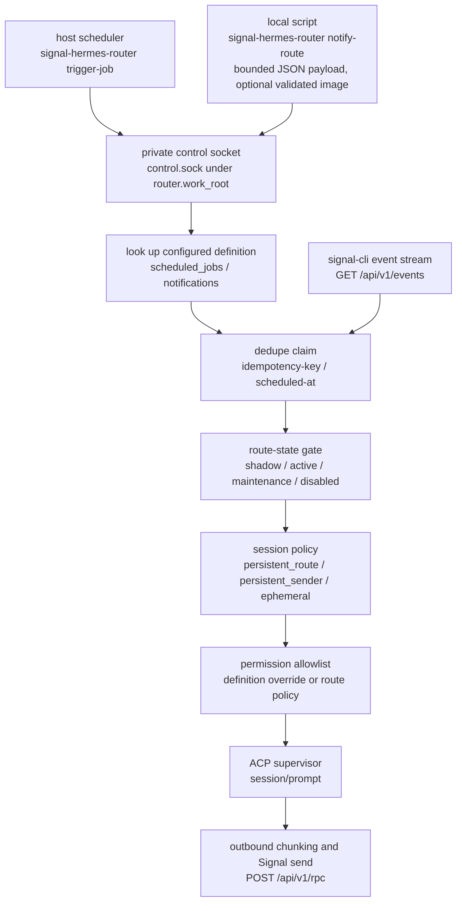

# Synthetic Route Events

Synthetic route events let trusted local automation trigger a configured
Signal route through the running router. A scheduler supplies a configured job
ID. A script supplies a configured notification ID plus a bounded JSON payload.
Neither path supplies a Signal group ID. The router looks up the synthetic
definition, injects a synthetic turn for the target route, calls Hermes through
the normal ACP supervisor, and delivers any assistant reply through the normal
Signal outbound path.

Use this when a host timer or local script needs to send a routed Signal report
but you still want router-owned route state, session policy, permission
allowlists, chunking, Signal retries, redacted logs, dedupe, and circuit
breaker behavior.

Do not use a Hermes Signal gateway cron job or a direct `signal-cli send` for
these route-owned messages. Those paths bypass the router's route policy and
can create a separate ACP session, a second Signal sender, or unredacted
delivery behavior.

Both synthetic origins enter through the control socket and merge into the same turn path as an inbound Signal event:



## Scheduled Job Setup

1. Give the target route a stable private `name` in `routes.yaml`.
2. Add a top-level `scheduled_jobs` entry that references that route name.
3. Enable `router.control` in `config.yaml`.
4. Start the router normally.
5. Run `signal-hermes-router trigger-job <job-id>` from the same host.

Example route and scheduled job:

```yaml
routes:
  - platform: "signal"
    name: "agenda-route"
    group_id: "SIGNAL_GROUP_ID_BASE64_EXAMPLE"
    profile: "example-hermes-profile"
    session_policy: "persistent_route"
    state: "active"
    route_context:
      purpose: "Synthetic public example route."
      route_alias: "agenda"

scheduled_jobs:
  - id: "daily-agenda"
    route: "agenda-route"
    prompt: "Prepare the synthetic daily agenda for this route."
```

Example control config:

```yaml
router:
  work_root: "./private/work"
  control:
    enabled: true
    socket_path: "./private/work/control.sock"
    route_lock_timeout_seconds: 0
```

With that router already running:

```bash
signal-hermes-router --config /path/to/private/config.yaml trigger-job daily-agenda --scheduled-at 1714521600000 --idempotency-key daily-agenda-1714521600000
```

`trigger-job` only talks to the local control socket. It does not send Signal,
start Hermes, create sessions, or read route targets itself.

## Notification Setup

Add a top-level `notifications` entry that targets a named route:

```yaml
notifications:
  - id: "backup-report"
    route: "agenda-route"
    prompt: "Summarize the notification payload for this route."
```

Then have the local script write a JSON object or array to a private file and
call:

```bash
signal-hermes-router --config /path/to/private/config.yaml notify-route backup-report --payload-file /path/to/private/payload.json --idempotency-key backup-report-1714521600000
```

`notify-route` only talks to the local control socket. It validates the payload
as UTF-8 JSON, canonicalizes it to compact JSON with sorted object keys, checks
the configured byte limit, and sends the compact control request to the router.
The router repeats payload validation before creating the turn.

If `socket_path` is set explicitly, it must stay under `router.work_root`. This
keeps the socket inside a router-owned private directory instead of changing
permissions on shared directories such as `/tmp` or `/run`.

`--client-timeout` bounds the local control socket round trip and defaults to
300 seconds. `--timeout` is forwarded to the router as the route/profile lock
wait budget.

Notifications can include one trusted local image:

```bash
signal-hermes-router --config /path/to/private/config.yaml notify-route camera-person --payload-file /path/to/private/payload.json --attachment /path/to/private/media/camera/person.png --idempotency-key camera-person-1714521600000
```

`--attachment` is control metadata, not part of the canonical notification
payload JSON. See [docs/media.md](media.md#outbound-notification-images) for the
full staging contract, validation rules, `.outbound` artifact behavior, and
remote-signal-cli restrictions.

## Prompt Shape

Synthetic turns use the same prompt-safe route context preamble as Signal
turns. They then add a generated scheduled-event metadata block containing
safe fields such as origin, synthetic kind, synthetic ID, scheduled time, and
trigger time. The configured prompt is a separate text block after that
metadata.

Notifications add one extra text block containing the canonical JSON payload.
Payload delimiter-looking text is escaped before it reaches Hermes. There is
no arbitrary template interpolation in this path.

The router escapes route-context and scheduled-event delimiters in Signal user
text, configured synthetic prompt text, and notification payload text. A
configured prompt or payload cannot inject fake router metadata by including
delimiter-looking text.

## Route States and Session Policy

Scheduled turns use the same route state gate and session policy as inbound
Signal turns. See [docs/configuration.md](configuration.md) for the definitions
of `shadow`, `active`, `maintenance`, `disabled`, `persistent_route`,
`persistent_sender`, and `ephemeral`.

With `persistent_sender`, synthetic turns use a definition-specific sender
identity: `scheduled:<job-id>` for scheduled jobs and
`synthetic:notification:<notification-id>` for notifications, so different
definitions receive distinct persistent-sender sessions.

## Idempotency and Failure Handling

Use `--scheduled-at` for timer fires with a natural scheduled instant (epoch
milliseconds or timezone-aware ISO 8601). Use `--idempotency-key` when the
scheduler has a stable fire identifier; the router hashes the key before storing
it, so the raw key never enters the dedupe database.

Repeated scheduled triggers with the same job and `--scheduled-at`, or the same
`--idempotency-key`, are deduped. Notification triggers dedupe by
`--idempotency-key` when supplied. Bare manual triggers without stable identity
fields are treated as fresh attempts.

Crash-reclaim and at-least-once behavior differ by origin:
- **Synthetic turns:** a claim left `processing` by a crash is reclaimed at the
  next router startup, so the caller's retry with the same stable identity
  delivers instead of reporting `deduped`. A crash between the Signal send and
  the identity being marked `handled` can duplicate output on retry. This
  guarantee is scoped to externally retried synthetic work. Reclaim is safe
  because the router owns the state DB exclusively: the dedupe store holds an
  exclusive sqlite lock for the router's lifetime, so an overlapping second
  router fails at startup instead of sharing the DB, and no turn is in flight
  when the lock is first taken.
- **Signal-origin turns:** have no router-owned replay path. A crash or shutdown
  during a Signal turn is redelivered only if upstream `signal-cli` happens to
  replay the event.

If a synthetic turn fails during ACP session setup, prompt execution, or profile
recovery, the router returns an `error` response, sends the configured failure or
maintenance reply when the route state allows it, and releases the synthetic
dedupe claim so the scheduler can retry after the operator fixes the underlying
issue. Route-owned failure responses include safe observability fields for scheduler
logs: `route_ref`, `profile`, `last_failure_at_ms`, `reply_sent`, and the
sanitized `failure` object with stable `code`, `message`, `provider_class`,
and bounded detail fields. ACP session-acquisition model/provider failures use
model/provider codes only when Hermes supplies structured JSON-RPC
`error.data.code`; text-only quota or rate-limit wording remains
`acp_session_failed`. Successful synthetic turns still mark the dedupe identity
handled, and Signal send failures still mark it handled because Hermes work
already completed.

For route-lock semantics (lock coverage, busy behavior, retry rules), see the
Route Lock Contention section below.

## Route Lock Contention

The router holds one async lock per route while a turn is in flight. That lock
covers dedupe claim, state gate, session lookup, permission policy install,
Hermes prompt, Signal reply, and dedupe cleanup. This prevents a synthetic
turn and a human Signal turn for the same route session from swapping
permission policies mid-turn.

`router.control.route_lock_timeout_seconds: 0` means acquire the lock
immediately or return `busy`. A `busy` response is not a failure, does not call
Hermes, does not send Signal output, and does not write a dedupe row. Retrying
the same stable fire identity can still deliver later.

Positive timeout values wait up to that many seconds before returning `busy`.

## Permission Overrides

If a synthetic definition sets `permissions`, that static allowlist applies
only to that synthetic turn. The next ordinary Signal turn on the same route
restores the route's normal permission policy. If the definition omits
`permissions`, the route policy is used.

Prefer narrow permissions. Synthetic prompts are deployment-owned, but the
profile still runs as the same Hermes profile and can request tools during the
turn.

## Shared Health

Synthetic and human-origin turns share the same route circuit breaker and
maintenance behavior. A failing synthetic turn can trip the route breaker that
also protects human Signal traffic. A synthetic trigger during maintenance can
send the route's maintenance reply. This coupling is intentional because
synthetic delivery is route-owned delivery.

## Timer Examples

Cron example:

```cron
5 6 * * * /path/to/venv/bin/signal-hermes-router --config /path/to/private/config.yaml trigger-job daily-agenda --scheduled-at "$(date -u +\%Y-\%m-\%dT06:05:00+00:00)" --idempotency-key "daily-agenda-$(date -u +\%Y\%m\%d)"
```

Systemd service example:

```ini
[Unit]
Description=Trigger synthetic daily agenda route event

[Service]
Type=oneshot
ExecStart=/bin/sh -c 'exec /path/to/venv/bin/signal-hermes-router --config /path/to/private/config.yaml trigger-job daily-agenda --scheduled-at "$$(date -u +%%Y-%%m-%%dT%%H:%%M:%%S+00:00)"'
```

Systemd timer example:

```ini
[Unit]
Description=Run synthetic daily agenda route event

[Timer]
OnCalendar=*-*-* 06:05:00
Persistent=true

[Install]
WantedBy=timers.target
```

## Public Boundary

Keep real Signal group IDs, sender UUIDs, phone numbers, hostnames, private
route names, profile names, credential names, real prompts, and real payload
examples in the private deployment repo. The public examples in this repo use
synthetic identifiers only. See [AGENTS.md](../AGENTS.md#publicprivate-boundary).
